```{r include=FALSE}
require(knitr)
opts_chunk$set(out.width = '75%', fig.align = 'center')
```

\newpage

# Οδηγός Εγκατάστασης της LibRadtran σε περιβάλλον Windows. #


> *Αρχικός οδηγός από τον Κώστα Φράγκο, προσαρμογή από Θανάση Νάτση.*


Η LibRadtran είναι ένα πακέτο επίλυσης της εξίσωσης της διάδοσης της ακτινοβολίας μιας διάστασης (1D). Αποτελείται από ξεχωριστούς κώδικες γραμμένους σε γλώσσα 'C' ή/και 'Fortran'. Πριν να είναι κάποιος σε θέση να χρησιμοποιήσει τη LibRadtran θα πρέπει να "μεταγλωττίσει" και να "συνδέσει" (εγκατάσταση) τις ξεχωριστές ρουτίνες μεταξύ τους. Επειδή, το πακέτο είναι κατασκευασμένο να δουλεύει σε περιβάλλον Linux, για να το εγκαταστήσουμε σε περιβάλλον Windows απαιτούνται κάποιες επιπρόσθετες διαδικασίες, οι οποίες περιγράφονται βήμα-βήμα σε αυτόν τον οδηγό και περιγράφονται πιο συνοπτικά στις οδηγίες εγκατάστασης σε περιβάλλον Windows στη σελίδα της [LibRadtran](http://www.libradtran.org/doc/README.windows).

## Εγκατάσταση του λειτουργικού περιβάλλοντος 'Cygwin'. ##

Αρχικά εγκαθιστούμε τη σουίτα 'Cygwin', που μας επιτρέπει να εκτελούμε εντολές Linux. Κατά τη διάρκεια της εγκατάστασης του 'Cygwin' πρέπει να σιγουρευτούμε ότι έχουμε περιλάβει όλες τις απαραίτητες βιβλιοθήκες που απαιτούνται για την ομαλή εγκατάσταση της LibRadtran. Αυτές είναι οι ακόλουθες:

```{bash eval=F,tidy=F}
bash  binutils  cygwin  flex  gawk
gcc   gzip      make    tar
```

Από την ιστοσελίδα του [Cygwin](http://cygwin.com) κατεβάζουμε το [πρόγραμμα εγκατάστασης του Cygwin](http://cygwin.com/setup-x86.exe). *__Σημείωση__ ακόμα και αν έχουμε 64bit έκδοση λειτουργικού, καλό θα ήταν να εγκαταστήσουμε την 32bit έκδοση του 'Cygwin', για να αποφύγουμε στη συνέχεια κάποιες επιπλέον ρυθμίσεις*.

```{r execdown, echo = FALSE, fig.cap = "Κατέβασμα και αποθήκευση του εκτελέσιμου προγράμματος εγκατάστασης του 'Cygwin'.", fig.env='img'}
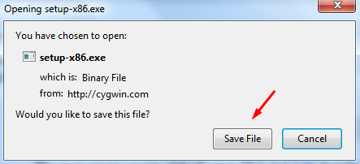
```

Αφού κατεβάσουμε το εκτελέσιμο (Εικόνα \@ref(fig:execdown)), πατάμε δεξί κλικ και επιλέγουμε 'Run as Administrator' (Εκτέλεση ως διαχειριστής) (Εικόνα \@ref(fig:runexec)).

```{r runexec, echo = FALSE, fig.cap = "Εκτέλεση του προγράμματος εγκατάστασης του 'Cygwin'.", fig.env='img'}
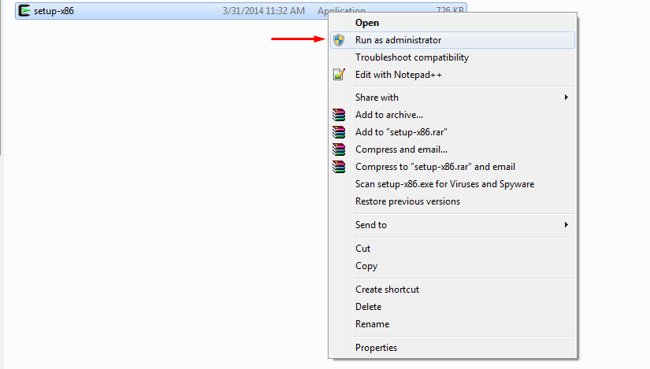
```

Στις επόμενες επιλογές πατάμε 'yes' και 'Next', μέχρι να δούμε την Εικόνα \@ref(fig:execinst), όπου θα επιλέξουμε να κάνουμε εγκατάσταση από το διαδίκτυο (install from internet) και στη συνέχεια την επιλογή 'Next'.

```{r execinst, echo = FALSE, fig.cap = "Εγκατάσταση του Cygwin χρησιμοποιώντας το Internet.", fig.env='img'}
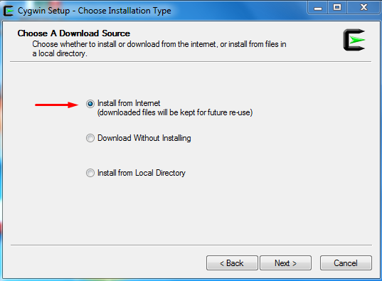
```

Επιλέγουμε να αφήσουμε το default directory εγκατάστασης (\@ref(fig:instopts)) και συνεχίζουμε πατώντας 'Next'. Είναι καλό ο φάκελος εγκατάστασης που θα επιλέξουμε να μην έχει κενά, να αποτελείται μόνο από λατινικούς χαρακτήρες και είναι δυνατόν να βρίσκεται στο `c:\` (root των Windows).

```{r instopts, echo = FALSE, fig.cap = "Επιλογή εγκατάστασης του Cygwin στο default directory.", fig.env='img'}
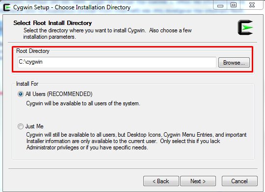
```

Προσπερνάμε την επόμενη σελίδα που θα μας βγάλει, πατώντας 'Next' και στη συνέχεια επιλέγουμε τον τύπο σύνδεσής μας στο Internet (συνήθως είναι direct connection) και επιλέγουμε το 'Next' (Εικόνα \@ref(fig:optscone)).

```{r optscone, echo = FALSE, fig.cap = "Επιλογή σύνδεσης στο Internet.", fig.env='img'}
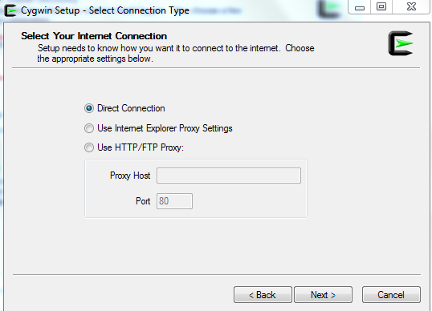
```

Στην επόμενη καρτέλα διαλέγουμε από που θέλουμε να κατεβάσουμε τα πακέτα που είναι απαραίτητα για την εγκατάσταση του 'Cygwin'. Κάνοντας scroll down με το ποντίκι μπορούμε να βρούμε κάποια τοποθεσία στην Ελλάδα (π.χ. στην Εικόνα \@ref(fig:netloc) έχει γίνει επιλογή του ftp του Μετσόβιου Πολυτεχνείου. Κάποιος μπορεί να επιλέξει οποιαδήποτε τοποθεσία θέλει, επιλέγοντας κάποια τοποθεσία στην Ελλάδα ελαχιστοποιεί το χρόνο που χρειάζεται για να κατέβουν τα πακέτα εγκατάστασης).

```{r netloc, echo = FALSE, fig.cap = "Επιλογή τοποθεσίας για το κατέβασμα του 'Cygwin'.", fig.env='img'}
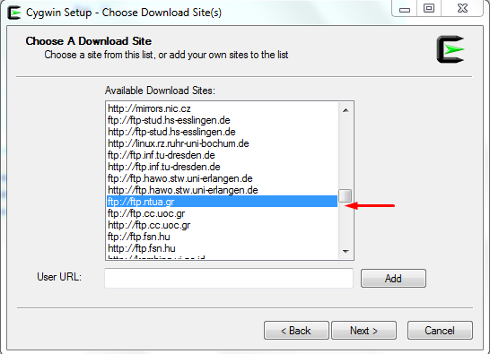
```

Στην επόμενη σελίδα θα διαλέξουμε τα πακέτα που χρειάζονται για την εγκατάσταση της LibRadtran τα όποια όπως είδαμε πιο πάνω είναι: `bash, binutils, cygwin, flex, gawk, gcc, gzip, make, tar`. Στο πλαίσιο που έχει για αναζήτηση (Εικόνα \@ref(fig:setpack)) τοποθετούμε καθένα πακέτο ξεχωριστά και κάνουμε αναζήτηση για να δούμε αν είναι προεγκατεστημένο ή χρειάζεται να το επιλέξουμε εμείς. Συνήθως, τα πακέτα βρίσκονται στις κατηγορίες 'Base', 'Devel' και 'Utils'.

```{r setpack, echo = FALSE, fig.cap = "Αναζήτηση των πακέτων που είναι απαραίτητα να εγκατασταθούν.", fig.env='img'}
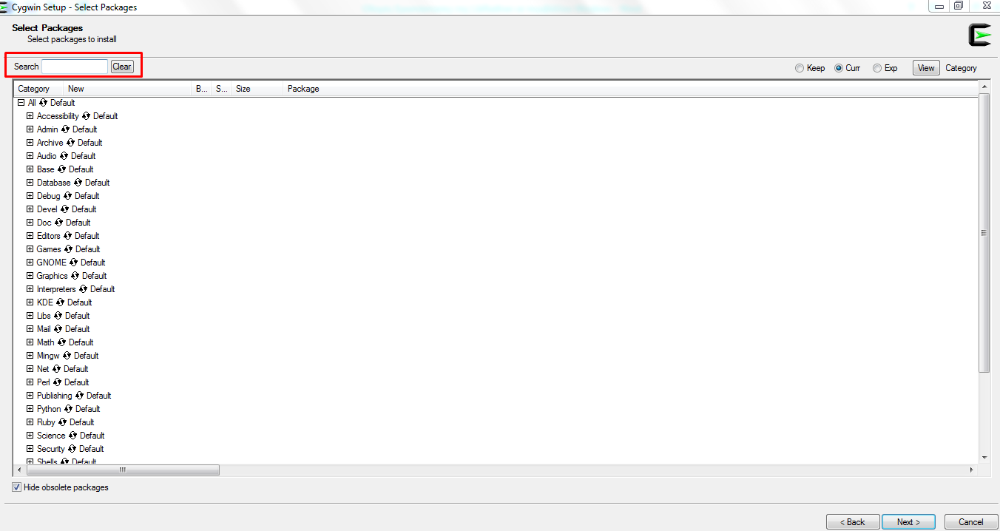
```

Ξεκινούμε αναζητώντας το πακέτο `bash` (Εικόνα \@ref(fig:setbash)) όπου παρατηρούμε ότι είναι ήδη στα πακέτα που γίνονται εγκατάσταση.

```{r setbash, echo = FALSE, fig.cap = "Αναζήτηση του πακέτου `bash`, παρατηρούμε ότι είναι προεγκατεστημένα πακέτα του Cygwin.", fig.env='img'}
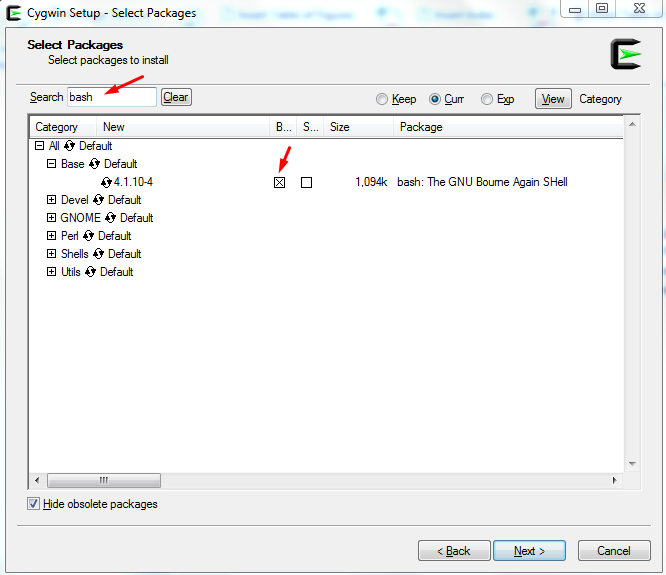
```

Στη συνέχεια αναζητούμε το `binutils`, το οποίο είναι στο 'Devel' (Εικόνα \@ref(fig:setbinut)) παρατηρούμε ότι έχει την επιλογή `Skip`, πατώντας μια φορά με το ποντίκι πάνω στο 'Skip', αλλάζουμε την κατάσταση ώστε να εγκατασταθεί, όπως φαίνεται στην Εικόνα \@ref(fig:setbinutB). Την ίδια διαδικασία ακολουθούμε και για όλα τα υπόλοιπα πακέτα που παρατηρούμε ότι δεν περιέχονται από default (όπως το `bash`) στην εγκατάσταση του 'Cygwin'.

```{r setbinut, echo = FALSE, fig.cap = "Αναζήτηση της επιλογής `binutils`.", fig.env='img'}
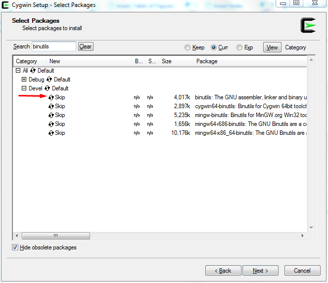
```

```{r setbinutB, echo = FALSE, fig.cap = "Επιλογή εγκατάστασης του `binutils`.", fig.env='img'}
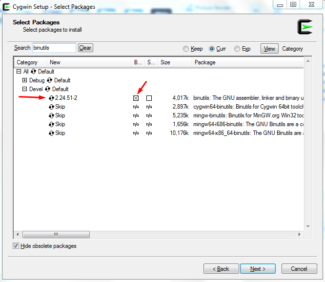
```

Εν συνεχεία αναζητούμε το 'Cygwin', το οποίο όπως παρατηρούμε στην Εικόνα \@ref(fig:setcygw), εγκαθίσταται ως default επιλογή.

```{r setcygw, echo = FALSE, fig.cap = "Αναζήτηση του 'Cygwin', δεν χρειάζεται κάποια μεταβολή.", fig.env='img'}
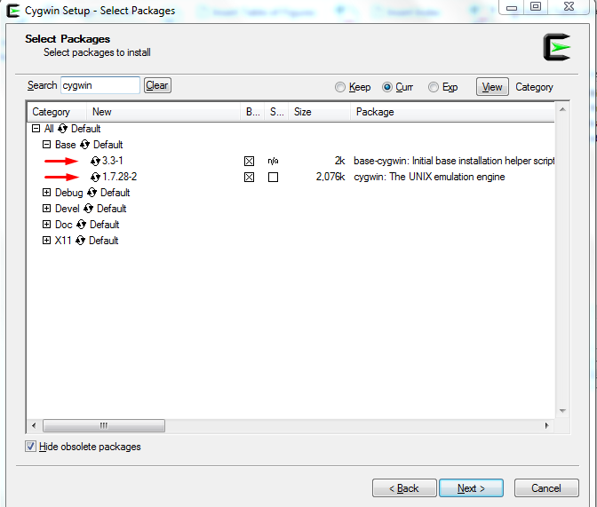
```

Το πακέτο `flex` δεν περιέχεται στα default πακέτα εγκατάστασης, οπότε κάνουμε ότι για το πακέτο `binutils`, έτσι ώστε να δούμε την Εικόνα \@ref(fig:setflex).

```{r setflex, echo = FALSE, fig.cap = "Επιλογή εγκατάστασης του πακέτου `flex`.", fig.env='img'}
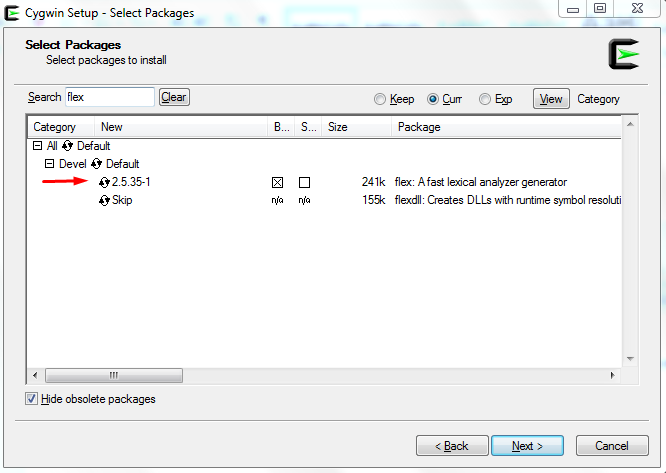
```

Το πακέτο `gawk`, βρίσκεται ανάμεσα σε αυτά που εγκαθίστανται από default (Εικόνα \@ref(fig:setgawk)).

```{r setgawk, echo = FALSE, fig.cap = "Αναζήτηση του πακέτου `gawk`.", fig.env='img'}
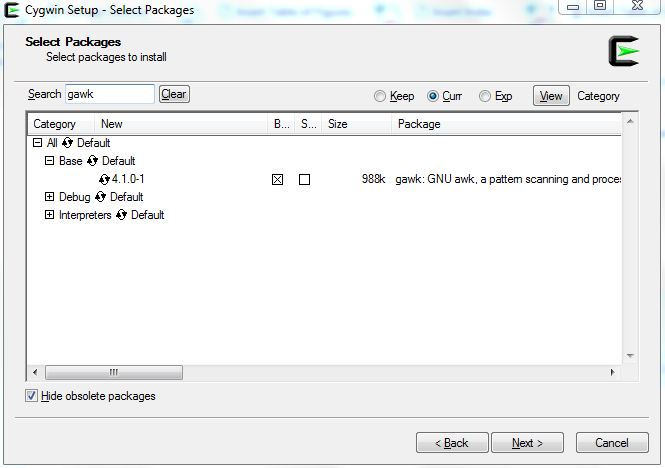
```

Ο `gcc` είναι ο compiler που μεταγλωττίζει κώδικα γλώσσας 'C' και 'Fortran'. Επιλέγετε για εγκατάσταση αυτούς που φαίνονται στην Εικόνα \@ref(fig:setgcc).

```{r setgcc, echo = FALSE, fig.cap = "Εγκατάσταση του compilers `gcc` για μεταγλώττιση του κώδικα C και Fortran.", fig.env='img'}
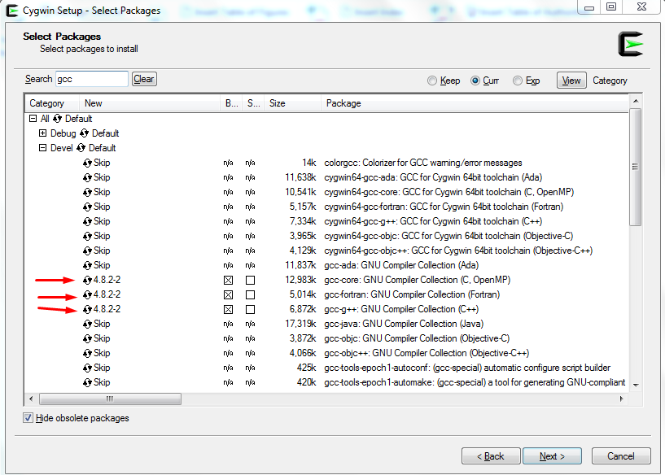
```

To `gzip` είναι από τα default πακέτα του 'Cygwin' (Εικόνα \@ref(fig:setgzip)).

```{r setgzip, echo = FALSE, fig.cap = "Αναζήτηση του πακέτου `gzip`.", fig.env='img'}
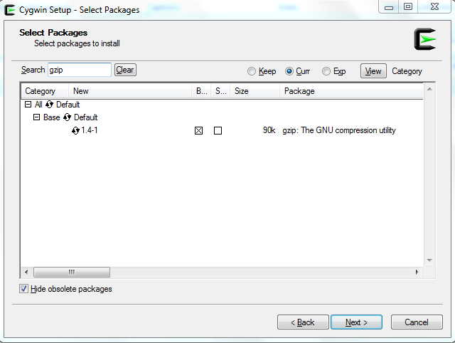
```

To `make` δεν είναι στα default οπότε χρειάζεται να αλλάξουμε την κατάστασή του για να εγκατασταθεί (Εικόνα \@ref(fig:setmake)).

```{r setmake, echo = FALSE, fig.cap = "Εγκατάσταση του πακέτου `make`.", fig.env='img'}
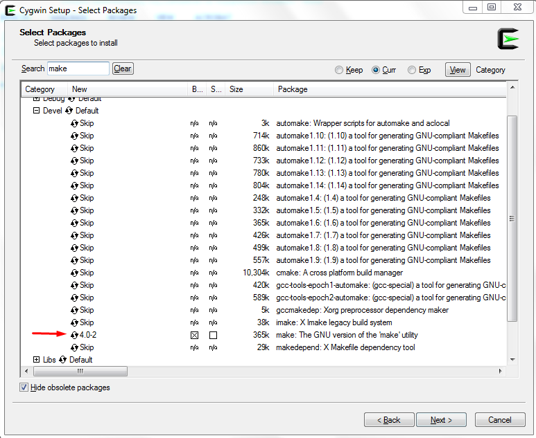
```

To `tar` εγκαθίσταται από default (Εικόνα \@ref(fig:settar)).

```{r settar, echo = FALSE, fig.cap = "Αναζήτηση του πακέτου `tar`.", fig.env='img'}
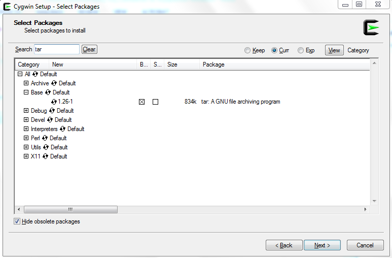
```

Τέλος εκτός από τα παραπάνω που είναι απαραίτητα για την εγκατάσταση της LibRadtran, καλό θα ήταν να εγκαταστήσουμε μαζί με το 'Cygwin' και τη γλώσσα 'Perl', αλλάζοντας το status από default σε install (Εικόνα \@ref(fig:setperl)).

```{r setperl, echo = FALSE, fig.cap = "Εγκατάσταση της γλώσσας 'Perl' σε περιβάλλον 'Cygwin'.", fig.env='img'}
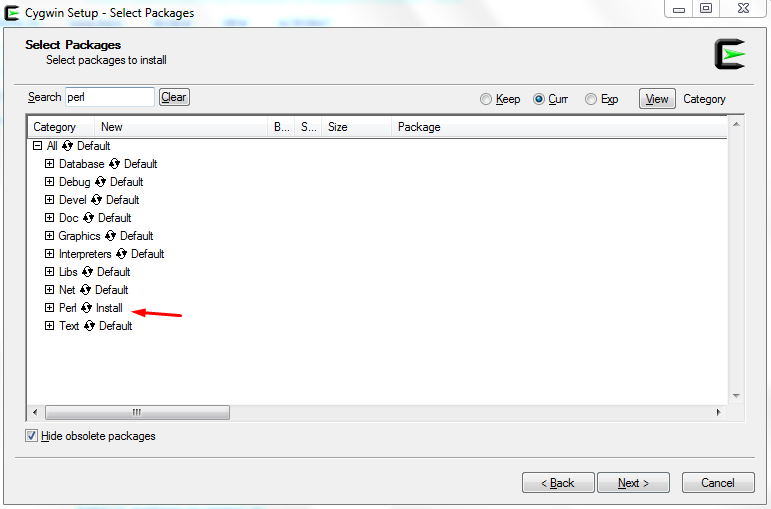
```

Αφού ολοκληρώσουμε τον έλεγχο για τα πακέτα που θέλουμε να εγκαταστήσουμε πατάμε 'Next', όπου μετά θα δούμε όλα τα πακέτα που εγκαθίστανται και πατάμε 'Next', οπότε ξεκινάει το κατέβασμα και η εγκατάσταση του 'Cygwin' και των πακέτων που επιλέξαμε (Εικόνα \@ref(fig:instcygw)).

```{r instcygw, echo = FALSE, fig.cap = "Εγκατάσταση του 'Cygwin'.", fig.env='img'}
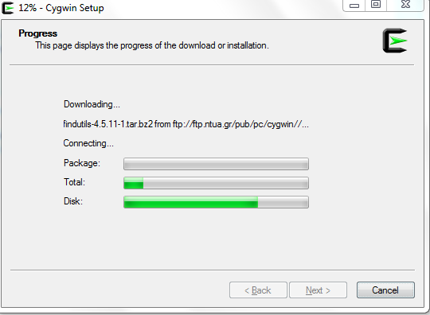
```

```{r instend, echo = FALSE, fig.cap = "Ολοκλήρωση εγκατάστασης του 'Cygwin'.", fig.env='img'}
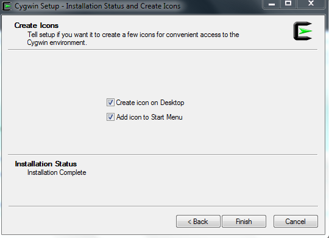
```


## Εγκατάσταση της LibRadtran. ##

Κατεβάζουμε τη LibRadtran από το [site](http://www.libradtran.org/doku.php?id=download). Παλιότερες εκδόσεις της LibRadtran μπορούν να βρεθούν [εδώ](http://www.libradtran.org/download/history/).

Αφού ολοκληρωθεί η λήψη του αρχείου, το τοποθετούμε στο φάκελο `c:\cygwin\home` (Εικόνα \@ref(fig:libloc)).

```{r libloc, echo = FALSE, fig.cap = "Κατάλογος στον οποίο θα γίνει η εγκατάσταση της LibRadtran.", fig.env='img'}
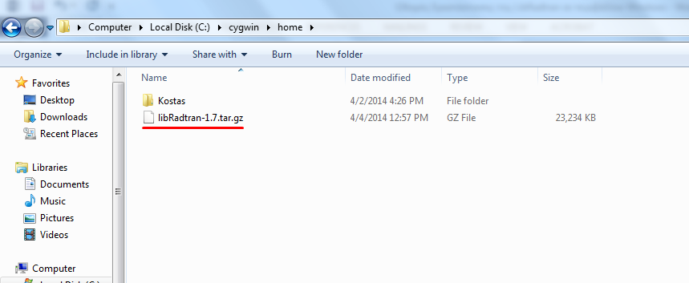
```

Ανοίγουμε το τερματικό του 'Cygwin' από την επιφάνεια εργασίας, εκτελούμε την εντολή `cd ..` για να βρεθούμε στο 'home' και στη συνέχεια την εντολή `ls` για να σιγουρευτούμε ότι έχουμε το πακέτο της libRadtran στον κατάλογο που βρισκόμαστε (Εικόνα \@ref(fig:wdloc)).

```{r wdloc, echo = FALSE, fig.cap = "Κατάλογος εργασίας στο περιβάλλον 'Cygwin'.", fig.env='img'}
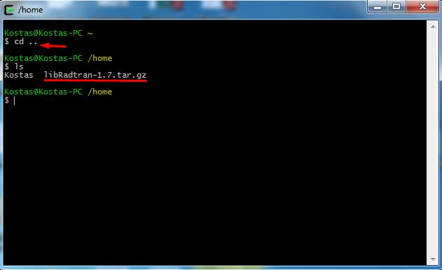
```

Αφού σιγουρευτούμε ότι έχουμε το πακέτο της LibRadtran στον φάκελο που βρισκόμαστε εκτελούμε τις ακόλουθες εντολές, για την αποσυμπίεση των αρχείων.

```{bash eval=F, size="scriptsize"}
gzip -d   libRadtran-1.7.tar.gz
tar  -xvf libRadtran-1.7.tar
```

στη συνέχεια με την εντολή `ls` επαληθεύουμε ότι έχει δημιουργηθεί ένας νέος φάκελος (Εικόνα \@ref(fig:libunzip)).

```{r libunzip, echo = FALSE, fig.cap = "Αποσυμπίεση του αρχείου Libradtran.tar.", fig.env='img'}
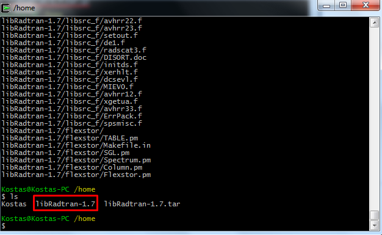
```

Γράφουμε `cd libRadtran-1.7`, για να μεταφερθούμε στον φάκελο της Libradtran, με `ls` μπορούμε να δούμε τα περιεχόμενα του φακέλου και στη συνέχεια γράφουμε την ακόλουθη εντολή, για να επιλέξουμε τον compiler για την μεταγλώττιση του κώδικα 'Fortran' (Εικόνα \@ref(fig:libfort)).

```bash
export F77=gfortran
```

```{r libfort, echo = FALSE, fig.cap = "Επιλογή του compiler για την αποσφαλμάτωση του κώδικα Fortran.", fig.env='img'}
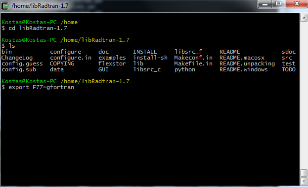
```

Τώρα εκτελούμε την εντολή `./configure`. Στο τέλος, θα πρέπει να δούμε στην οθόνη του τερματικού τα ακόλουθα όπως φαίνεται στην Εικόνα \@ref(fig:libconf).

```{r libconf, echo = FALSE, fig.cap = "Ολοκλήρωση της διαδικασίας configure.", fig.env='img'}
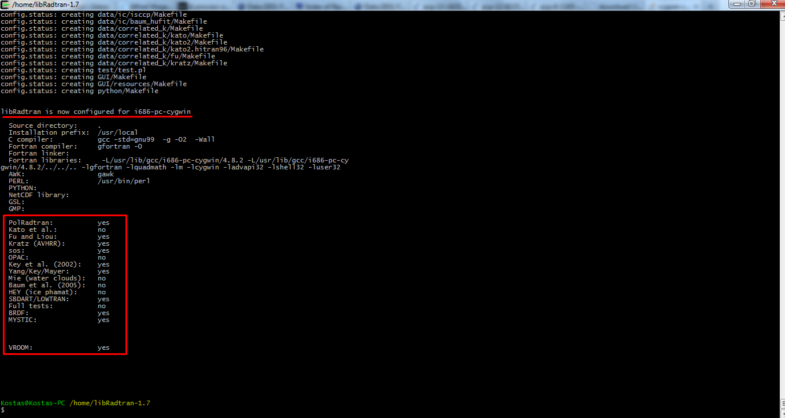
```

Η εγκατάσταση (compile) τώρα μπορεί να ολοκληρωθεί εκτελώντας την εντολή `make` και για σιγουρευτούμε ότι όλα είναι εντάξει κατά τη διάρκεια της εγκατάστασης, αφού τελειώσει η εντολή `make`, εκτελούμε την εντολή `make check`, όπου θα δούμε στην οθόνη του τερματικού μας μια σειρά από test, όπως στην Εικόνα \@ref(fig:mkcheck).

```{r mkcheck, echo = FALSE, fig.cap = "Έλεγχος της ορθής εγκατάστασης της Libradtran.", fig.env='img'}
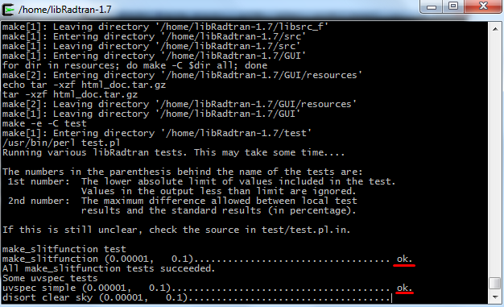
```

Εάν όλα έχουν ολοκληρωθεί επιτυχώς, στον φάκελο `libRadtran-1.7/bin` υπάρχουν μια σειρά από εκτελέσιμα αρχεία. Για την χρήση τους μπορείτε να ανατρέξετε στο manual της libRadtran ή στα αντίστοιχα αρχεία του πηγαίου κώδικα (source code) που πολλές φορές, μπορεί να είναι πολύ πιο κατατοπιστικά για τη λειτουργία που εκτελούν. Το κύριο εκτελέσιμο αρχείο του μοντέλου είναι το `uvspec`.


```{r include=FALSE}
require(knitr)
opts_chunk$set(out.width = '90%', fig.align = 'center')
```
